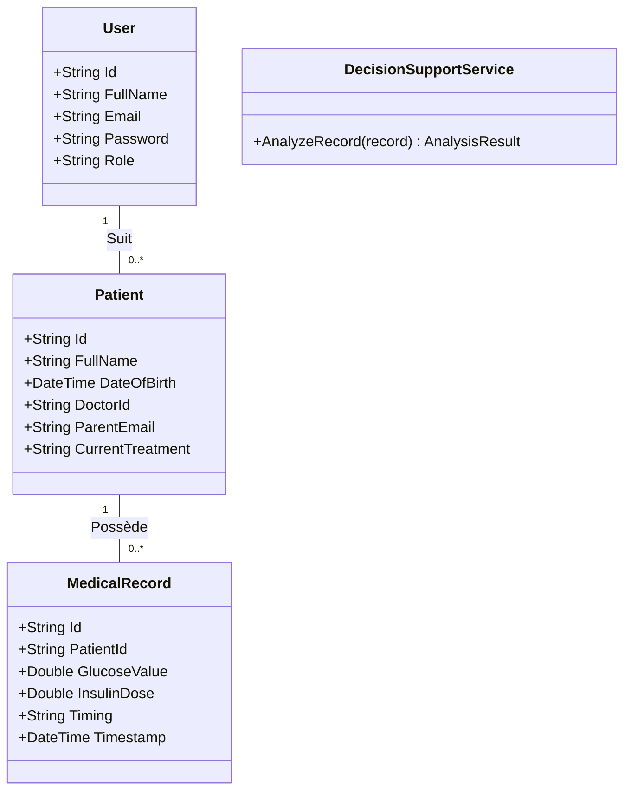
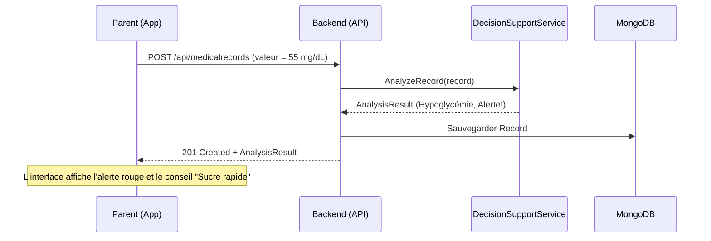
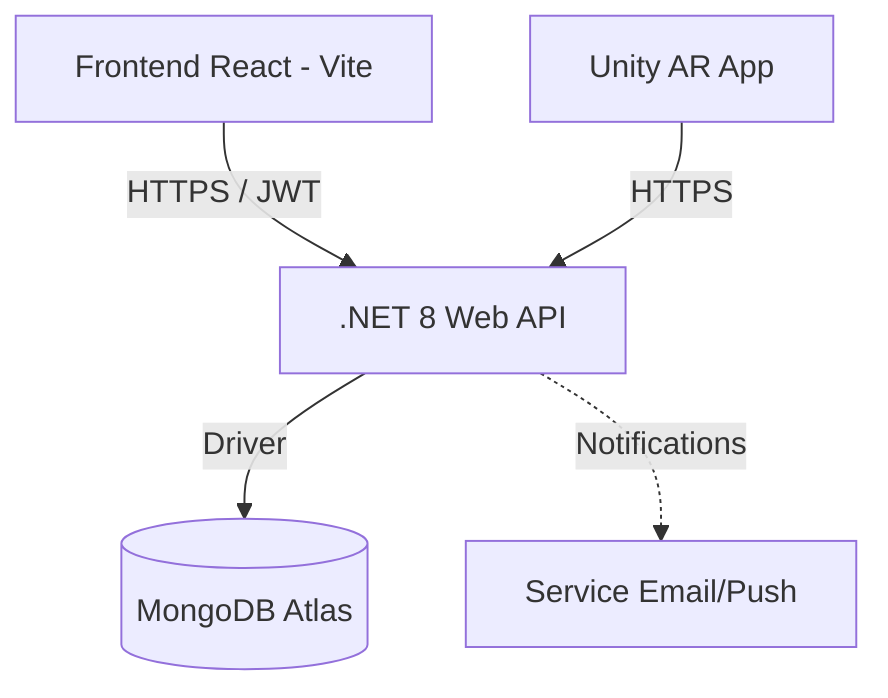

# Documentation UML - DiaCare Kids

Ce document regroupe les modélisations UML du système DiaCare Kids, structurées pour répondre aux exigences du cahier des charges.

## 1. Diagramme de Cas d’Utilisation

```mermaid
usecaseDiagram
    actor "Médecin" as Doc
    actor "Parent" as Par
    actor "Enfant" as Kid
    actor "Admin" as Adm

    package "DiaCare Kids Web/Mobile" {
        Doc --> (Suivi Médical)
        Doc --> (Analyse Historique)
        Doc --> (Générer Rapport PDF)
        
        Par --> (Saisie Glycémie/Insuline)
        Par --> (Consultation Conseils IA)
        Par --> (Recevoir Alertes)
        
        Adm --> (Gestion Cliniques)
        Adm --> (Gestion Utilisateurs)
    }

    package "DiaCare Kids AR" {
        Kid --> (Visualisation 3D Corps)
        Kid --> (Mini-jeux Éducatifs)
    }
```

## 2. Diagramme de Classes (Backend)



## 3. Diagramme de Séquence : Saisie Parent → Analyse → Recommandation



## 4. Diagramme d’Architecture



---
*Document généré par DiaCare GPT pour le projet de fin d'études.*
